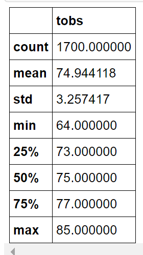
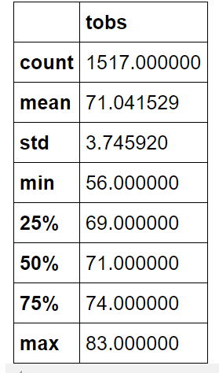
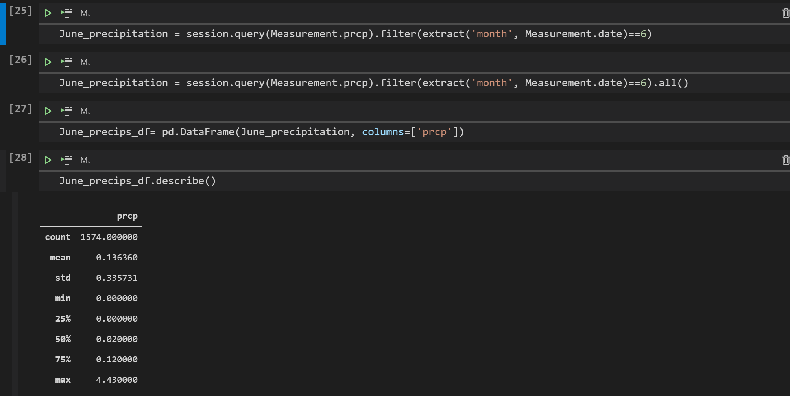
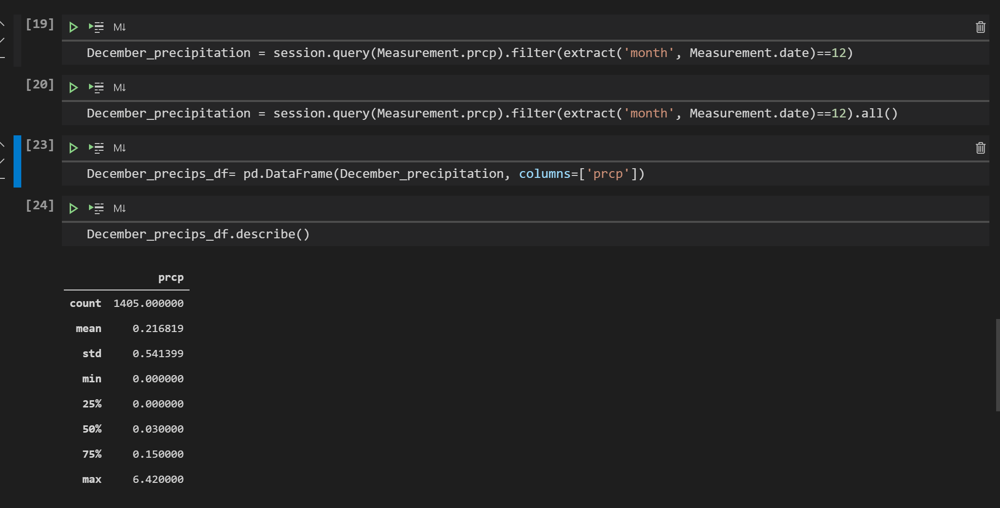

# surfs_up

## Overview of Analysis

The overview of this analysis was to find the temperature trends to make sure this would be a good location for a business in year round. We wanted to look at precipatation and temperature to make sure that weather would not intefer with the businesses bottom line. We took the months of June and December and looked at the temperature statistics to verify the surf and ice cream shop business would be sustainable year round.

## Results

First we queried the data to collect all temperatures for the month of June. We had to filter it so we extracted only the month date from the date column. Then we generated summary statistics of temperatures for the month of June using the describe function. There we could see the count, mean, std, min, quartile percentages, and max temp. This showed us a good overall picture of what weather in June is like. 

**June Results**

Next we queried the data to collect all temperatures for the month of December. Again, we had to filter it so we only extracted the month date from the date column. Then we generated summary statistics of temperatures for the month of December using the describe function. This gave us the count, mean, std, min temp, quartile percentages, and max temp. Using this, gives us a good idea of what weather in December looks like. 

**December Results**

There were a couple of differences between June and December. First December's minimum temperature was 56 compared to 64. December's maximum temperature was 83 whereas June's maximum temperature was 85. Lastly, the average temperature in June was 75 whereas the average temperature in December was 71. December is a cooler month by June, as expected with a colder season.

## Summary

June looks to be relatively a good weather month, looking at temperatures. The minimum temperature in June is 64 and the max is 85 with the average temperature being 75. This is perfect weather to open a business in. Quartile percentages and std also look in line as well, not showing any outliers or days that went to far outside of this range. 

December weather also looks to be promising for a winter month. The minimum temperature for December is 56 and the max is 83 with the average temperature being 71. This has a bit more of a range than June, but as expected due to the season. The quartile percentages and std also look to be in line, not showing any significant outliers. 56 is a bit chilly, but for a winter month it extremely warm compared to most other areas of the world. 

Both June and December have similar weather patterns, and the data does not show any reason not open up a shop year round. Using June and Decemeber months, the surf and ice cream shop business would be sustainable year round.

**Additional Queries**

Two additional queries I'd look into, would be to look at the precipation for both June and December. I'd want to make sure those months don't have a ton of rain or subsceptible to hurricanes. Too much rain could also make a business not sustainable year round.  Here I'd change the query I used above in temperatures to extract the precipation column instead of temperature column to gain this information.

Analyzing both June and December precipitation statistics, neither month seems to have a lot of rain. Using the mean, it shows the average of .13cm precipitation a day for June and .17cm precipitation a day for December. Both months had a couple days where it rained a lot, since the max precipitation was 6cm in Decemmer, and 4cm in June, but the average precipitation is low enough and quartiles also low, that these days seem to be more like outliers and nothing to be concerned about.
